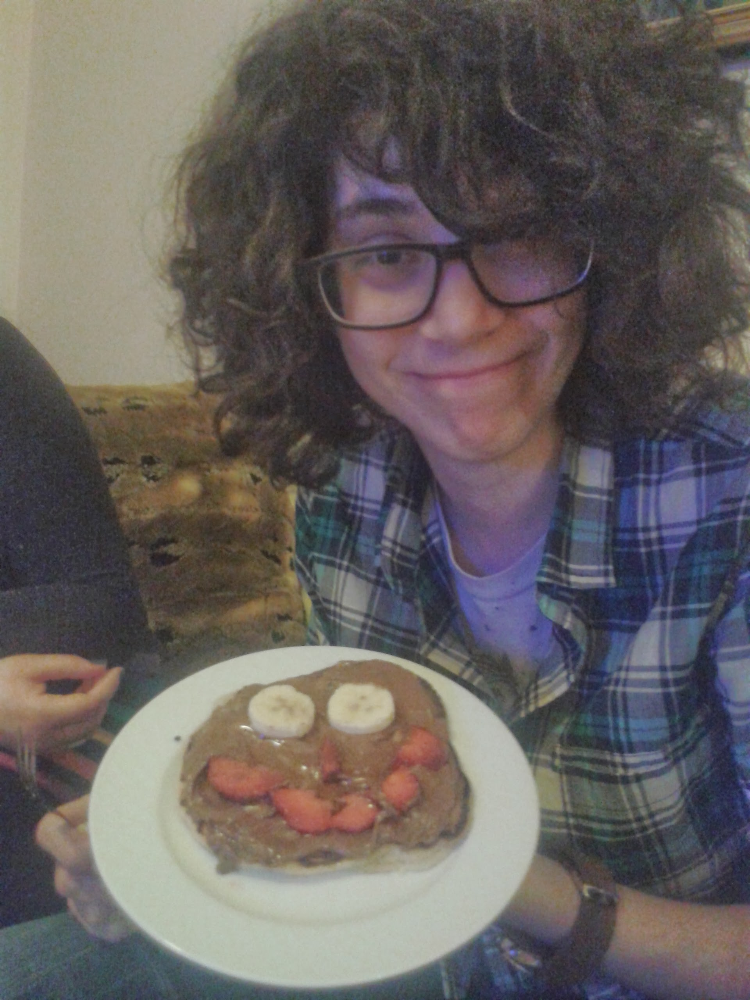

# Περι… Bachelor Site 💍

Static website για το bachelorette της Πέρι στο Ναύπλιο, 18 Ιουνίου 2026.

## Πώς να το ανεβάσεις στο GitHub Pages

### 1. Δημιούργησε repository
Πήγαινε στο github.com → New repository  
Δώσε όνομα π.χ. `peri-bachelor`  
Βάλε το Public (απαραίτητο για δωρεάν GitHub Pages)

### 2. Ανέβασε τα αρχεία
```
peri-bachelor/
├── index.html        ← το κυρίως αρχείο
├── photos/           ← βάλε εδώ τις φωτογραφίες μετά την εκδρομή
│   ├── photo1.jpg
│   └── photo2.jpg
└── README.md
```

Μπορείς να τα ανεβάσεις απευθείας από το GitHub UI (drag & drop) ή με git.

### 3. Ενεργοποίησε το GitHub Pages
Settings → Pages → Source: **Deploy from a branch** → Branch: **main** → Save

Σε 1-2 λεπτά το site θα είναι στο:  
`https://[username].github.io/peri-bachelor/`

## Πώς να προσθέσεις φωτογραφίες

Μετά την εκδρομή, βάλε τις φωτογραφίες στον φάκελο `photos/` και στο `index.html` βρες το `<div id="gallery">` και άντικατέστησε το περιεχόμενό του με:

```html
<div class="gallery">
  
  
  
  <!-- κ.ο.κ. -->
</div>
```

Το gallery κάνει αυτόματα masonry layout με 2-3 columns!
